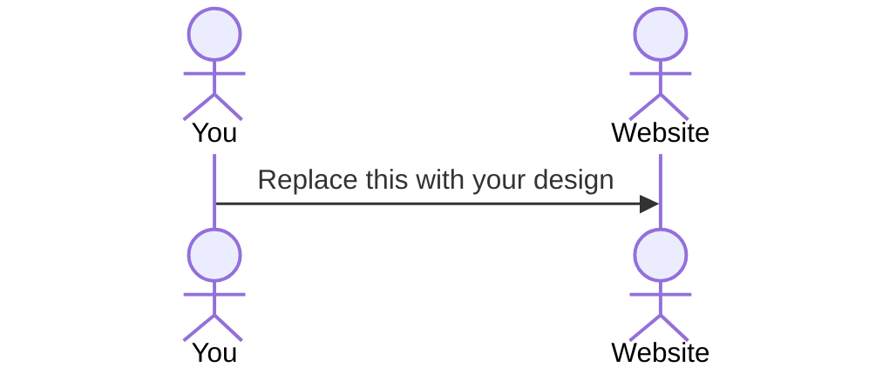

# Your startup name here

[My Notes](notes.md)

This project is an interactable cheat sheet for the popular tower defense game BTD6. Will allow the player to select one of 25 towers (each of which has 15 possible upgrades) and fetch up to date stats about each of the towers' upgrades, including upgrade crosspath functionality and listings of Bloon type weaknesses/strengths.

> [!NOTE]
>  This is a template for your startup application. You must modify this `README.md` file for each phase of your development. You only need to fill in the section for each deliverable when that deliverable is submitted in Canvas. Without completing the section for a deliverable, the TA will not know what to look for when grading your submission. Feel free to add additional information to each deliverable description, but make sure you at least have the list of rubric items and a description of what you did for each item.

> [!NOTE]
>  If you are not familiar with Markdown then you should review the [documentation](https://docs.github.com/en/get-started/writing-on-github/getting-started-with-writing-and-formatting-on-github/basic-writing-and-formatting-syntax) before continuing.

## 🚀 Specification Deliverable

> [!NOTE]
>  Fill in this sections as the submission artifact for this deliverable. You can refer to this [example](https://github.com/webprogramming260/startup-example/blob/main/README.md) for inspiration.

For this deliverable I did the following. I checked the box `[x]` and added a description for things I completed.

- [x] Proper use of Markdown
- [x] A concise and compelling elevator pitch
- [x] Description of key features
- [x] Description of how you will use each technology
- [x] One or more rough sketches of your application. Images must be embedded in this file using Markdown image references.

### Elevator pitch

My startup project will be an interactable cheat sheet for a video game that I and my family like to play: BTD6. BTD6 is a tower defense video game that involves strategic placement/upgrading of monkey "towers" that will pop waves of Bloons that spawn on a track before they reach the exit. While the game does a good job describing at a surface level what each tower and its upgrades do, it still hides a lot of specific stats for said towers that would only be accessible outside the game itself and on the web. What good is buying the final upgrade for a Banana Farm if its in-game description is "You want Banana? We have Banana!" That doesn't tell you much, does it? The goal of this project is to create an interactable diagram for all of a given tower's upgrades that'll tell the player exactly what they may want to know about the tower. With this resource available, it'll become much easier to come up with a viable strategy for popping those pesky Bloons before they reach the exit and end your game!

### Design

The diagram above shows an upgrade tree for any given monkey tower in BTD6. It lists all 3 possible upgrade paths, the upgrade names, and their upgrade costs. Detailed stats will become available once the player "upgrades" the tower by selecting one of the upgrade boxes depicted in the sketch. There are limitations on how many upgrades can be selected at once—upgrades can only be selected from two rows. One row can be upgraded in sequence all the way to tier 5 (abbreviated as T5 in the sketch), while an additional row can be upgraded to Tier 2. Upgrades cannot be bought from all three rows at once.

### Key features

- The chosen tower will be shown on the left side alongside some basic info that can be referred to in a pinch (e.g. what Bloon types the tower can/cannot pop, the selected game difficulty, etc.)
- User can select any valid combination of upgrades from the three-branched tree
- Once selected, the user can open/view detailed stats of each upgrade (e.g. range, pierce, attack speed, abilities)
- May also include pop-up definitions for BTD6 vocabulary (e.g. pierce, de-camo, crosspath, ability)

### Technologies

I am going to use the required technologies in the following ways.

- **HTML** - Basic layout of upgrade tree (likely in the form of a table); 
- **CSS** - Text/table styling, drop down menus to avoid overwhelming the user with too much info at once
- **React** - Pop-up definitions for BTD6 vocabulary; programming valid upgrade/crosspath combination rules
- **Service** - Retrieving up-to-date information on each tower's stats (since content updates often change tower stats for balancing purposes)
- **DB/Login** - User login, storing of stats/other info for all 25 towers
- **WebSocket** - Notification handling (upgrade selection, invalid upgrade attempt, etc.)

## 🚀 AWS deliverable

For this deliverable I did the following. I checked the box `[x]` and added a description for things I completed.

- [ ] **Server deployed and accessible with custom domain name** - [My server link](https://yourdomainnamehere.click).

## 🚀 HTML deliverable

For this deliverable I did the following. I checked the box `[x]` and added a description for things I completed.

- [ ] **HTML pages** - I did not complete this part of the deliverable.
- [ ] **Proper HTML element usage** - I did not complete this part of the deliverable.
- [ ] **Links** - I did not complete this part of the deliverable.
- [ ] **Text** - I did not complete this part of the deliverable.
- [ ] **3rd party API placeholder** - I did not complete this part of the deliverable.
- [ ] **Images** - I did not complete this part of the deliverable.
- [ ] **Login placeholder** - I did not complete this part of the deliverable.
- [ ] **DB data placeholder** - I did not complete this part of the deliverable.
- [ ] **WebSocket placeholder** - I did not complete this part of the deliverable.

## 🚀 CSS deliverable

For this deliverable I did the following. I checked the box `[x]` and added a description for things I completed.

- [ ] **Header, footer, and main content body** - I did not complete this part of the deliverable.
- [ ] **Navigation elements** - I did not complete this part of the deliverable.
- [ ] **Responsive to window resizing** - I did not complete this part of the deliverable.
- [ ] **Application elements** - I did not complete this part of the deliverable.
- [ ] **Application text content** - I did not complete this part of the deliverable.
- [ ] **Application images** - I did not complete this part of the deliverable.

## 🚀 React part 1: Routing deliverable

For this deliverable I did the following. I checked the box `[x]` and added a description for things I completed.

- [ ] **Bundled using Vite** - I did not complete this part of the deliverable.
- [ ] **Components** - I did not complete this part of the deliverable.
- [ ] **Router** - I did not complete this part of the deliverable.

## 🚀 React part 2: Reactivity deliverable

For this deliverable I did the following. I checked the box `[x]` and added a description for things I completed.

- [ ] **All functionality implemented or mocked out** - I did not complete this part of the deliverable.
- [ ] **Hooks** - I did not complete this part of the deliverable.

## 🚀 Service deliverable

For this deliverable I did the following. I checked the box `[x]` and added a description for things I completed.

- [ ] **Node.js/Express HTTP service** - I did not complete this part of the deliverable.
- [ ] **Static middleware for frontend** - I did not complete this part of the deliverable.
- [ ] **Calls to third party endpoints** - I did not complete this part of the deliverable.
- [ ] **Backend service endpoints** - I did not complete this part of the deliverable.
- [ ] **Frontend calls service endpoints** - I did not complete this part of the deliverable.
- [ ] **Supports registration, login, logout, and restricted endpoint** - I did not complete this part of the deliverable.

## 🚀 DB deliverable

For this deliverable I did the following. I checked the box `[x]` and added a description for things I completed.

- [ ] **Stores data in MongoDB** - I did not complete this part of the deliverable.
- [ ] **Stores credentials in MongoDB** - I did not complete this part of the deliverable.

## 🚀 WebSocket deliverable

For this deliverable I did the following. I checked the box `[x]` and added a description for things I completed.

- [ ] **Backend listens for WebSocket connection** - I did not complete this part of the deliverable.
- [ ] **Frontend makes WebSocket connection** - I did not complete this part of the deliverable.
- [ ] **Data sent over WebSocket connection** - I did not complete this part of the deliverable.
- [ ] **WebSocket data displayed** - I did not complete this part of the deliverable.
- [ ] **Application is fully functional** - I did not complete this part of the deliverable.
